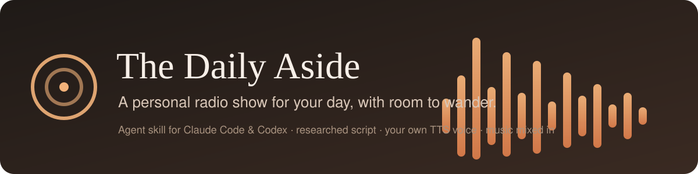
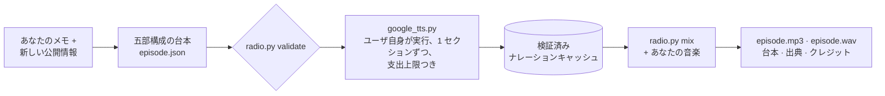

<p align="center">
  
</p>

<p align="center">
  <a href="https://github.com/LeeAkinobu/daily-aside-radio-skill/releases/latest"></a>
  <a href="LICENSE"></a>
  
  
  
  
  
</p>

<p align="center">
  <a href="README.md">English</a> · <b>日本語</b> &nbsp;|&nbsp;
  <a href="https://leeakinobu.github.io/daily-aside-radio-skill/">▶ 聴いてみる</a> · <a href="#仕組み">仕組み</a> · <a href="#インストール">インストール</a> · <a href="#番組を作る">番組を作る</a> · <a href="examples/README.md">サンプル</a>
</p>

The Daily Aside は [Claude Code](https://code.claude.com/docs/en/skills) と [Codex](https://learn.chatgpt.com/docs/build-skills) 向けのエージェントスキルです。いくつかのメモと新しい公開情報から、ゆったりしたパーソナルラジオ番組を作ります。出力は、音楽をミックス済みの MP3、WAV マスター、台本、取得時刻付きの出典一覧、音楽クレジット。再生用のウェブサイトは不要です。

## 聴いてみる

2026 年 10 月 9 日にこのスキルで実際に制作した 2 本のエピソードです。生成後は無編集。波形をクリックするとプレイヤーページが開きます。MP3 のダウンロードは [v0.1.0 リリース](https://github.com/LeeAkinobu/daily-aside-radio-skill/releases/tag/v0.1.0)から。

<a href="https://leeakinobu.github.io/daily-aside-radio-skill/#ja"></a>

**日本語 · 7:35 · ボイス Nika** — 寒露と世界郵便デー、対数的超高速カメラ、国語に関する世論調査、家族ケアと心の距離。[台本と出典](examples/2026-10-09-ja/)

> 「瞬間」と「その後」を、一枚の流れとして見る。なんだか、物語の書き方にも似ていますね。

<a href="https://leeakinobu.github.io/daily-aside-radio-skill/#en"></a>

**English · 7:34 · ボイス Sulafat** — 世界郵便デー、2026 年ノーベル物理学賞・文学賞、世界メンタルヘルスデー。[Script and sources](examples/2026-10-09-en/)

> A whole block of polar ice, listening patiently for something that almost never speaks.

音楽はどちらも Kevin MacLeod「Continue Life」（incompetech.com、CC BY 4.0）。

## 作られるもの

- 五部構成：オープニング、3 つのメイントピック、明日への一言
- 暮らし・科学・文化の話題と、任意で個人や仕事の近況
- 音楽のイントロ、4 回のトピック間の間奏、穏やかなアウトロ
- 既定は英語。言語・ロケール・番組名・DJ 名・語り口は設定可能
- 既定プリセットで約 7 分半。実際の長さは生成後に計測

仕事の近況は任意で、番組の 30〜40% 以内に収めます。英語のプリセットは 850〜1050 語、日本語は 1950〜2250 文字（空白とポーズタグを除く）。その他の言語は明示的な分量指定が必要です。

## 仕組み

1. エージェントが一次ソースからその日の話題を集め、五部構成の台本を書き、出典 URL と取得時刻を含む episode JSON を保存します。
2. `radio.py validate` が構成と言語別の分量を検査します。
3. ユーザが自分の Google Gemini TTS アカウントで、同梱の `google_tts.py` を自分で実行してナレーションを生成します。1 セクションずつ、明示した支出上限のもとで動きます。既存のナレーション WAV や、承認済みの別 TTS 連携からの取り込みも可能です。
4. `radio.py mix` がナレーションとユーザ自身の音楽を `episode.mp3` と `episode.wav` に合成します。ダッキング、固定長の間奏、フェードを施し、クレジットを書き出します。



TTS リクエスト以外はすべてオフラインで、Python 標準ライブラリと ffmpeg だけで動きます。実際に制作したサンプルは [examples/](examples/README.md) にあります。

## 必要なもの

- フォルダ型スキルに対応したアシスタント、または Python のコマンドライン環境
- Python 3.10 以上、ffmpeg、ffprobe
- Google Gemini TTS のモデルとボイス、およびユーザ自身の認証情報と課金設定。または承認済みの TTS 連携、または既存のナレーション WAV
- 使用権のある音楽ファイルと、その出典情報

音楽、認証情報、アカウント情報はスキルに含まれません。スキルをインストールしても TTS アカウントの設定や課金の承認は行われません。

## インストール

リポジトリを clone し、`skills/daily-aside/` をスキル検出フォルダにコピーします。コピーコマンドは既存のコピーを上書きしません。

```sh
git clone https://github.com/LeeAkinobu/daily-aside-radio-skill.git
cd daily-aside-radio-skill
python3 --version && ffmpeg -version | head -1 && ffprobe -version | head -1
```

Python 3.10 以上を使ってください。コマンド名が `python` の環境では読み替えてください。不足するツールは信頼できる公式ソースから自分でインストールしてください。このパッケージはソフトウェアのインストールやアカウント設定を行いません。

### Claude Code

```sh
python3 -c "import shutil; shutil.copytree('skills/daily-aside', '.claude/skills/daily-aside')"
```

そのフォルダを Claude Code で開き、`/daily-aside` と入力します。複数プロジェクトで使うなら `~/.claude/skills/daily-aside` にコピーしてください。ローカルの個人用ファイルだけでは Cowork やクラウドセッションにはインストールされません。詳細は [Claude Code のスキルガイド](https://code.claude.com/docs/en/skills)を参照してください。

### Codex CLI / IDE

```sh
python3 -c "import shutil; shutil.copytree('skills/daily-aside', '.agents/skills/daily-aside')"
```

そのフォルダを Codex で開き、`/skills` でスキルを探すか、プロンプトで `$daily-aside` と書きます。複数プロジェクトで使うなら `~/.agents/skills/daily-aside` にコピーしてください。詳細は [OpenAI のスキルガイド](https://learn.chatgpt.com/docs/build-skills)を参照してください。`agents/openai.yaml` のメタデータはコアの動作には必須ではありません。

### ChatGPT dots と ChatGPT デスクトップアプリ

このスキルは [ChatGPT の dot](https://learn.chatgpt.com/docs/dots) で書かれました。毎朝勝手に届く番組にとって、スケジュール実行ができ、自分のクラウドコンピュータを持ち、連携済みのソースを読める dot は自然な居場所です。スキルのルールに合う経路は 2 つあります。

- **ノート PC を接続する。** ChatGPT デスクトップアプリ経由で dot にあなたの PC を使わせ、上の手順でスキルをローカルに置きます。TTS コマンドは dot の承認フローを通してあなた自身の環境で実行されます。SKILL.md が認める「保護された認証経路」にあたります。
- **クラウドだけで完結させる。** スキルと、鍵を自分側で保持する TTS コネクタをプラグインにまとめ、`google_tts.py` の代わりに `prepare` → `reserve` → `import-response` の経路を使います。

どちらでも、dot は毎回「個人的な内容を入れるか」を聞き、TTS プロバイダに送る前にもう一度確認します。dot のクラウドコンピュータに ffmpeg が入っているかは未確認です。PC 接続の経路ならその問題は生じません。ChatGPT デスクトップアプリのローカルチャットでもスタンドアロンのスキルが使え、この点では Codex と同じ振る舞いです。

どの経路でも、同じ SKILL.md、Python スクリプト、references を使います。エージェントの権限と認証情報の扱いはホスト環境に依存します。

## まずは無料のオフラインチェック

`skills/daily-aside/` で：

```sh
python3 scripts/test_radio.py
python3 scripts/test_google_tts.py
python3 scripts/radio.py dry-run --out /path/to/new-test-output
```

期待結果：テスト 21 件がパスし、dry-run が約 49.25 秒の合成音と音楽を書き出します。dry-run はタイミングとフォーマットの検証用で、ナレーション付きの番組ではありません。これらのコマンドは Google に接続せず、認証情報を読まず、課金も発生しません。

## 番組を作る

### 試してみるプロンプト

まずオフラインで：

> The Daily Aside のオフライン回帰テストと合成音の dry-run を実行して。認証情報の読み取り、ネットワークアクセス、有料の音声生成、ソフトウェアのインストール、公開は一切しないこと。テスト出力はスキルの外の新しい非公開ディレクトリに置いて。失敗した項目と、実施しなかったチェックを報告して。

課金せずにエピソードを準備。スキルは最初に「今日の近況を入れるか」を必ず聞いてきます。数行書いて渡す、ソースの参照を許可する、公開情報のみにする、のいずれかで答えてください：

> The Daily Aside の約 8 分のエピソードを日本語（ja-JP）で、公開情報のみを使って準備して。今日の日付を使い、天気が必要ならおおまかな地名を聞いて。科学・文化・暮らしの話題と、明日への一言を入れて。五部構成の episode JSON、台本、取得時刻付きの一次ソースを非公開の出力ディレクトリに保存して。実際に使える Gemini のモデルとボイスを確認し、現在の料金を説明し、ローカルで実行する生成コマンドを正確に用意して。API キーは読まず、有料 API も呼ばないこと。台本・ボイス・サービス階層・BGM の権利・支出上限を私がレビューするところで止めて。

台本をレビューし、有料／無料のサービス階層を確認したうえで、用意された `google_tts.py --all` コマンドを、自分で設定した `GEMINI_API_KEY` のある環境で自分で実行します。最後に：

> ナレーションの生成が終わった。検証済みのキャッシュと、私が権利を持つローカルの BGM を使って MP3 と WAV を作って。音声の再生成や追加の課金はしないこと。実際の長さを計測し、最終ファイルがデコードできること、ピークとタイミングを確認し、台本・出典・音楽クレジットを提供して。すべて非公開のままにして。私が聴いて確認すべき点を教えて。

### ナレーションと支出

同梱の Google クライアントは 1 セクションずつ生成します。成功した音声は再利用し、送信前に各試行を記録し、結果不明のリクエストを自動で再試行せず、ローカルの見積上限を超えるリクエストを拒否します。ローカルの見積は保守的ですが、プロバイダの最終請求を保証するものではなく、同じアカウントを使う他のアプリの利用を制限することもできません。プロバイダの現在の料金を確認し、プロバイダ側の課金管理も併用してください。

API キーをアシスタントのチャット、ソースファイル、コマンドライン引数、issue、出力ドキュメントに貼り付けないでください。Google の [API キーの手順](https://ai.google.dev/gemini-api/docs/api-key)に従って設定してください。アシスタントはホストの認証情報の扱いに従う必要があり、認証を伴うステップをユーザに委ねることがあります。

無料の Gemini サービスに個人情報や機密情報を送らないでください。クライアントはサービス階層の指定を必須とし、明示的に「公開情報のみ」とレビュー済みでない限り、内容を個人情報として扱います。有料サービスでも現在の[利用規約](https://ai.google.dev/gemini-api/terms)を確認してください。

### 音楽と帰属表示

第三者の音楽は同梱していません。使用権のある音楽と、タイトル・作者・出典・ライセンス・変更内容（ループ、音量調整、ダッキング、フェード、ミックス）を記録したクレジットファイルを用意してください。出力の `credits.txt` と MP3 のコメントタグにその情報が含まれます。コードのライセンスは音楽のライセンスを変更しません。

## 出力

- `episode.mp3`：音楽ミックス済みの持ち運び用
- `episode.wav`：非圧縮のミックス
- `script.txt`：五部構成のナレーション
- `episode.json`：エピソード設定と取得時刻付きの出典
- `mix.json`：正確なタイミング、ゲイン情報、音楽クレジット
- `credits.txt`：人が読める音楽の帰属表示

生成したエピソードとキャッシュは非公開に保ってください。スキルを共有しても、誰かのエピソード、素材、アカウント情報が共有されることはありません。

## 検証状況

- オフラインテストとモックプロバイダのテストで、タイミング、フォーマット処理、キャッシュの整合性、重複リクエストの防止、結果不明時の扱い、費用見積の検査、リダイレクト、認証情報なしでの再利用を検証しています。
- 2026 年 10 月 9 日に `gemini-3.8-flash-tts` を `generateContent` 経由で使ったエンドツーエンドの実行を完了しました。英語版（969 語、ボイス Sulafat）と日本語版（2101 文字、ボイス Nika）がそれぞれ約 7 分 35 秒の完成音声になり、正常にデコードでき、作者の聴感チェックを通過しています。プリセットはこの計測結果から設定しました。
- プロバイダのモデル、ボイス、料金、リクエスト形式は変わります。実行前に `references/tts.md` にある公式ドキュメントを確認してください。

## リポジトリ構成

- `skills/daily-aside/SKILL.md`：エージェントが従う手順
- `skills/daily-aside/scripts/`：`radio.py`（検証・計画・取り込み・ミックス）、`google_tts.py`（ユーザ実行のクライアント）、テスト
- `skills/daily-aside/references/`：編集方針、episode JSON の仕様、TTS の境界、音声処理のルール
- `examples/`：実際に制作したサンプルエピソード
- `SHA256SUMS`：追跡中の全ファイルのチェックサム
- `CLAUDE.md`：このリポジトリで作業するコーディングエージェント向けの指針

## ライセンス

コード、スキルの手順、同梱ドキュメントは [MIT ライセンス](LICENSE)（著作権 2026 Akinobu Lee）です。第三者の音楽や FFmpeg のバイナリは含みません。ユーザが選んだ音楽は、その音楽自身のライセンスと帰属表示の義務に従います。
