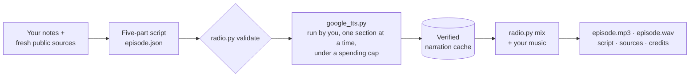

<p align="center">
  
</p>

<p align="center">
  <a href="https://github.com/LeeAkinobu/daily-aside-radio-skill/releases/latest"></a>
  <a href="LICENSE"></a>
  
  
  
  
  
</p>

<p align="center">
  <b>English</b> · <a href="README.ja.md">日本語</a> &nbsp;|&nbsp;
  <a href="https://leeakinobu.github.io/daily-aside-radio-skill/">▶ Listen</a> · <a href="#how-it-works">How it works</a> · <a href="#installation">Install</a> · <a href="#making-a-programme">Make a programme</a> · <a href="examples/README.md">Examples</a>
</p>

The Daily Aside is an agent skill for [Claude Code](https://code.claude.com/docs/en/skills) and [Codex](https://learn.chatgpt.com/docs/build-skills). It turns a few notes and fresh public sources into an unhurried personal radio programme: a finished MP3 with music already mixed in, plus a WAV master, the script, a timestamped source list, and music credits. No player website is required.

## Listen

Two real episodes made with this skill on 2026-10-09, untouched after generation. Click a waveform to open the player page, or download the MP3s from the [v0.1.0 release](https://github.com/LeeAkinobu/daily-aside-radio-skill/releases/tag/v0.1.0).

<a href="https://leeakinobu.github.io/daily-aside-radio-skill/#en"></a>

**English · 7:34 · voice Sulafat** — World Post Day, the 2026 Nobel Prizes in Physics and Literature, World Mental Health Day. [Script and sources](examples/2026-10-09-en/)

> A whole block of polar ice, listening patiently for something that almost never speaks.

<a href="https://leeakinobu.github.io/daily-aside-radio-skill/#ja"></a>

**日本語 · 7:35 · voice Nika** — 寒露と世界郵便デー、対数的超高速カメラ、国語に関する世論調査、家族ケアと心の距離。[台本と出典](examples/2026-10-09-ja/)

> 「瞬間」と「その後」を、一枚の流れとして見る。なんだか、物語の書き方にも似ていますね。

Music in both: "Continue Life" by Kevin MacLeod (incompetech.com), CC BY 4.0.

## What it makes

- Five sections: an opening, three main topics, and one thought for tomorrow
- A mixture of everyday life, science, culture, and optional personal/work updates
- A musical introduction, four topic breaks, and a gentle outro
- English by default; configurable language, locale, programme name, DJ name, and delivery style
- About seven and a half minutes with the default presets; actual duration is measured after generation

Work updates are optional and take no more than 30–40% of a programme. The English preset is 850–1050 spoken words; Japanese has its own 1950–2250-character preset. Other languages supply an explicit spoken-text budget.

## How it works

1. The agent gathers the day's topics from primary sources, writes a five-part script, and saves an episode JSON with every source URL and retrieval timestamp.
2. `radio.py validate` checks the structure and the language-specific pacing budget.
3. The user generates narration with their own Google Gemini TTS account by running the bundled `google_tts.py` client themselves, one section at a time, under an explicit spending limit. Existing narration WAVs or another approved TTS integration can be imported instead.
4. `radio.py mix` renders the narration and the user's own music into `episode.mp3` and `episode.wav`, with ducking, fixed music gaps, and a fade, and writes the credits.



Everything except the TTS request runs offline on the standard Python library plus ffmpeg. Finished sample episodes are in [examples/](examples/README.md).

## Requirements

- An assistant that supports folder-based skills, or a Python command-line workflow
- Python 3.10+, ffmpeg, and ffprobe
- A Google Gemini TTS model and voice with the user's own credentials and billing, or an approved TTS integration, or existing narration WAVs
- A music file the user is entitled to use, with attribution information

No music, credentials, or account information are distributed with the skill folder. Installing the skill does not configure a TTS account or approve its charges.

## Installation

Clone this repository, then copy `skills/daily-aside/` into a skill discovery folder. The copy command refuses to overwrite an existing destination.

```sh
git clone https://github.com/LeeAkinobu/daily-aside-radio-skill.git
cd daily-aside-radio-skill
python3 --version && ffmpeg -version | head -1 && ffprobe -version | head -1
```

Use Python 3.10 or later. If your system calls it `python`, substitute that command throughout. Install missing tools from trusted official sources; this package does not install software or set up accounts.

### Claude Code

```sh
python3 -c "import shutil; shutil.copytree('skills/daily-aside', '.claude/skills/daily-aside')"
```

Open the folder in Claude Code and invoke `/daily-aside`. For use across projects, copy to `~/.claude/skills/daily-aside` instead. Local personal files do not by themselves install the skill in Cowork or cloud sessions. See [Claude Code's skill guide](https://code.claude.com/docs/en/skills).

### Codex CLI or IDE

```sh
python3 -c "import shutil; shutil.copytree('skills/daily-aside', '.agents/skills/daily-aside')"
```

Open the folder in Codex. Use `/skills` to find the skill, or mention `$daily-aside` in a prompt. For use across projects, copy to `~/.agents/skills/daily-aside` instead. See [OpenAI's skill guide](https://learn.chatgpt.com/docs/build-skills). The metadata in `agents/openai.yaml` is optional for the core workflow.

Both routes use the same portable SKILL.md, Python scripts, and references. Agent permissions and credential handling depend on the host.

## Start with a free offline check

From `skills/daily-aside/`:

```sh
python3 scripts/test_radio.py
python3 scripts/test_google_tts.py
python3 scripts/radio.py dry-run --out /path/to/new-test-output
```

Expected: 21 tests pass, and the dry run writes about 49.25 seconds of synthetic tones with music. The dry run is a timing and format fixture, not a narrated programme. None of these commands contact Google, read credentials, or incur charges.

## Making a programme

### Prompts to try

Offline first:

> Run the offline regression tests and synthetic audio dry run for The Daily Aside. Do not read credentials, make network requests, generate paid speech, install software, or publish anything. Put test outputs in a new private directory outside the skill. Report any failures and which checks you did not perform.

Prepare an episode without spending:

> Prepare a roughly eight-minute episode of The Daily Aside in English, locale en-US, using public information only. Use today's date and ask for a coarse weather location if needed. Include science, culture, everyday life, and one thought for tomorrow. Save the five-part episode JSON, script and timestamped primary sources in a private output directory. Check which Gemini model and voice I can actually use, explain current pricing, and prepare the exact local generation command. Do not read my API key or call the paid API. Stop for my review of the script, voice, service tier, BGM rights and total spending limit.

Then review the script, confirm your paid or unpaid service tier, and run the prepared `google_tts.py --all` command yourself with your own configured `GEMINI_API_KEY`. Finally:

> The narration has been generated. Use the verified cached chunks and my authorized local BGM to render MP3 and WAV. Do not regenerate speech or incur any further charge. Measure the actual duration, check the final files decode, inspect peaks and timing, and provide the script, timestamped sources and music credits. Keep everything private. Tell me what still needs my listening check.

### Narration and spending

The bundled Google client generates one section at a time. It reuses verified successful audio, records each attempt before sending, never automatically retries an unknown request, and refuses a request that would exceed a local estimated-cost limit. The local estimate is conservative and is not a guarantee of the provider's final invoice, and it cannot limit other applications using the same account. Check current provider pricing and use the provider's billing controls as well.

Never paste a key into an assistant chat, source file, command-line argument, issue, or output document. Configure it through Google's own [API-key instructions](https://ai.google.dev/gemini-api/docs/api-key). An assistant must respect its host's credential-handling rules and may need to hand the authenticated step to the user.

Do not send personal or confidential information to unpaid Gemini services. The client requires the service tier and treats material as personal unless explicitly reviewed and marked public-only. Check the current [provider terms](https://ai.google.dev/gemini-api/terms) even when using a paid service.

### Music and attribution

No third-party music is bundled. Supply music you are entitled to use and a credit file recording the title, creator, source, license, and changes (looping, level adjustment, ducking, fades and mixing). The output includes that information in `credits.txt` and in the MP3 comment tag. The code license does not relicense any music.

## Outputs

- `episode.mp3`: portable listening copy with music baked in
- `episode.wav`: uncompressed mix
- `script.txt`: five-part narration
- `episode.json`: episode configuration and timestamped sources
- `mix.json`: exact timing, gain information and music credit
- `credits.txt`: readable music attribution

Keep generated episodes and caches private. Sharing the skill does not share anyone's episode, source material, or account information.

## Verification status

- Offline and mocked-provider tests cover timing, format handling, cache integrity, duplicate-request guards, unknown-outcome handling, cost-estimate checks, redirects, and credential-free reuse.
- A live end-to-end run was completed on 2026-10-09 with `gemini-3.8-flash-tts` through `generateContent`: an English episode (969 words, voice Sulafat) and a Japanese episode (2101 characters, voice Nika) each produced about 7 minutes 35 seconds of finished audio, decoded cleanly, and passed a listening check by the author. The presets were set from those measurements.
- Provider models, voices, prices, and request formats change. Recheck the official documentation linked in `references/tts.md` before live use.

## Repository layout

- `skills/daily-aside/SKILL.md`: the instructions an agent follows
- `skills/daily-aside/scripts/`: `radio.py` (validate, plan, import, mix), `google_tts.py` (user-run client), and the tests
- `skills/daily-aside/references/`: editorial format, episode JSON schema, TTS boundary, audio rules
- `examples/`: finished sample episodes with scripts, sources, and credits
- `SHA256SUMS`: checksums of every tracked file
- `CLAUDE.md`: guidance for coding agents working on this repository

## License

The code, skill instructions, and bundled documentation are licensed under the [MIT License](LICENSE), copyright 2026 Akinobu Lee. No third-party music or FFmpeg binary is included. Music selected by a user retains its own license and attribution obligations.
